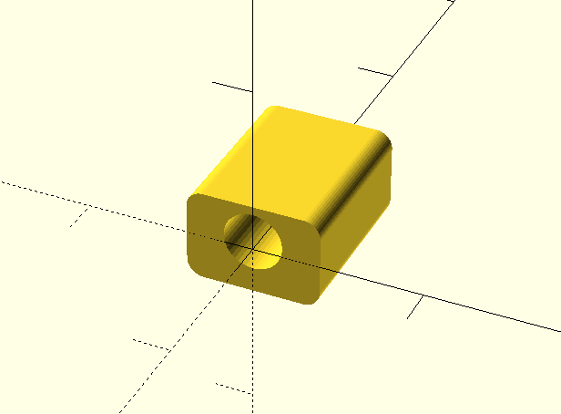
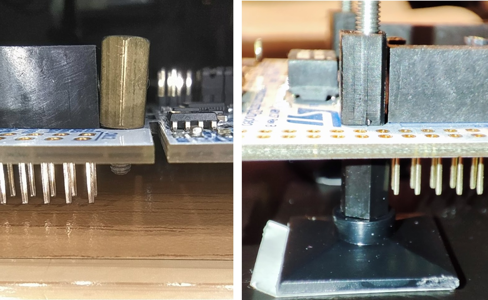

# Nucleo-144 mounting #

The [ST Nucleo-144](https://www.st.com/resource/en/user_manual/dm00244518-stm32-nucleo144-boards-mb1137-stmicroelectronics.pdf) board design is not designed with ease of mounting to custom feet or into enclosures. This is very apparent in the mounting holes found in the corners of the board, as these are far too close to the headers to allow for a standard M3 screw to fit.

This repository contains an OpenSCAD file describing a spacer that can be put next to the headers, allowing for an M3x16 or similar bolt to be slotted through and mounted to feet or other mounting point behind the board without interfering with the board's headers.

An STL object file is also provided for convenience. 

**Note:** the thinnest side of the spacer is mounted towards the header. Make sure this thin side is kept intact when 3D printing. For e.g. MSLA printers, position the thick-walled side onto the build plate.

OpenSCAD render:

Before and after graphic, showing the problem on the left, and the installed solution on the right:

This part was printed out using a Creality LD-002r MSLA resin printer and installed on a Nucleo-144 board, into plastic feet.